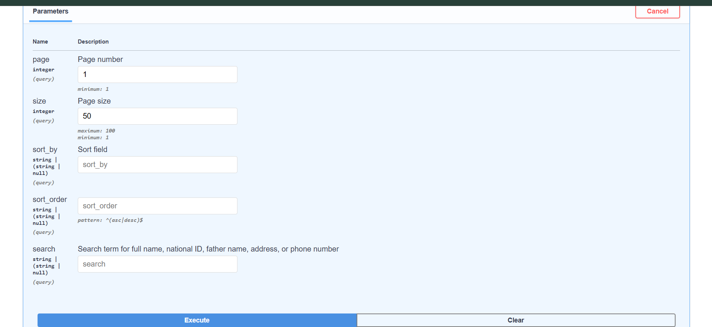
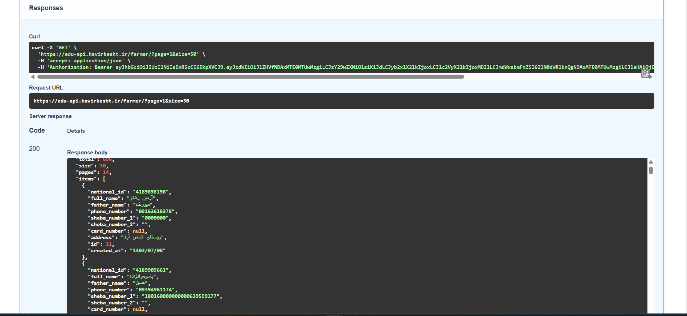
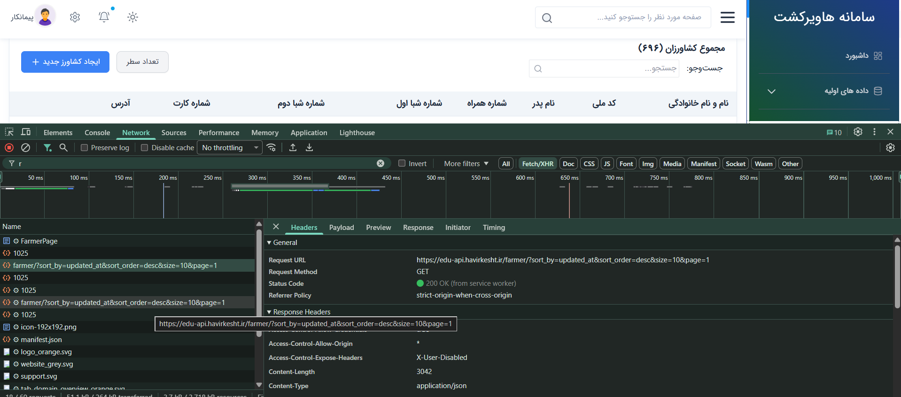
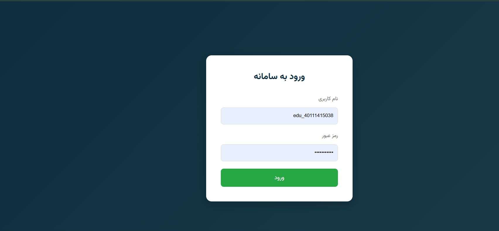
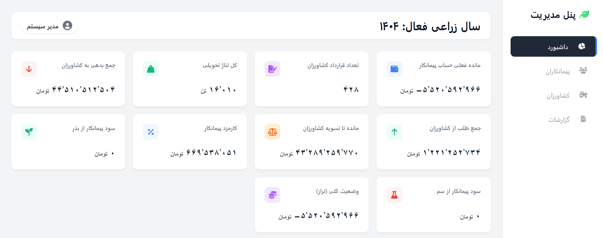
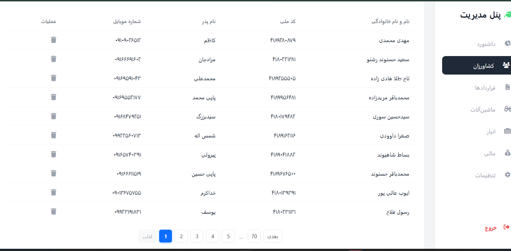
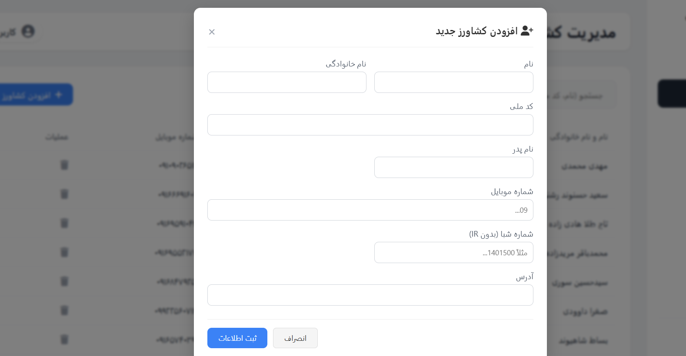
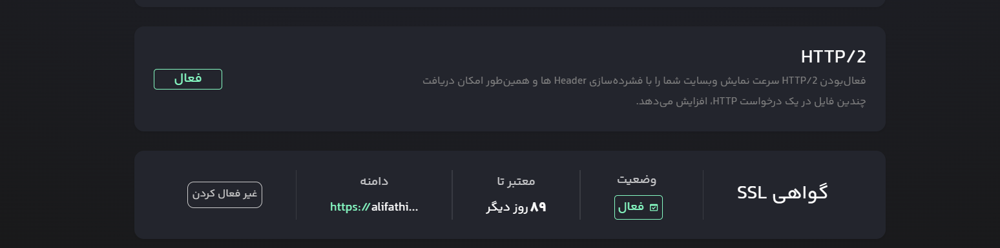
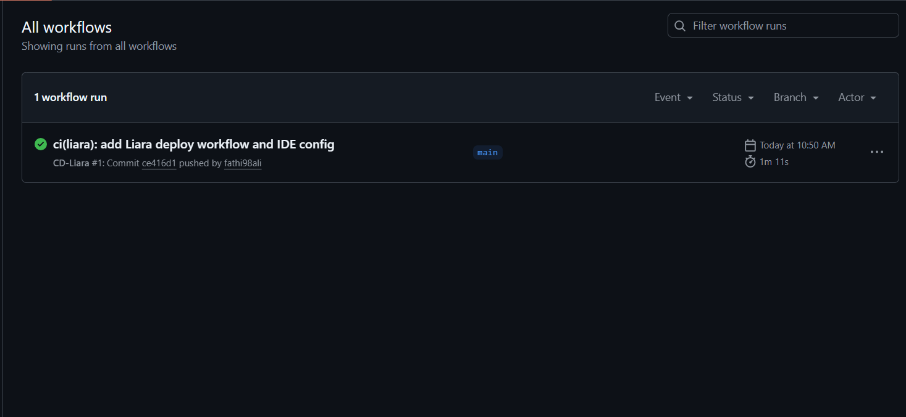
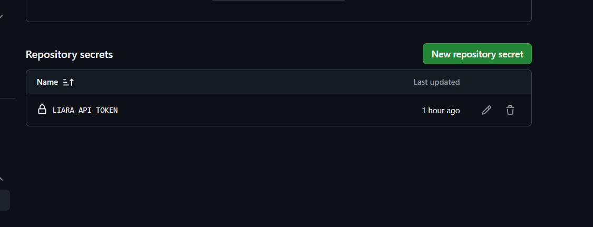

<div dir="rtl">


##  فاز اول: بررسی ساختار سایت و تحلیل API ها

در فاز اول پروژه، هدف اصلی آشنایی با ساختار کلی سایت هاویر کشت و شناسایی APIهای مورد استفاده در سیستم بود.

در ابتدا، سایت مورد نظر با استفاده از ابزار **Developer Tools** مرورگر مورد بررسی قرار گرفت تا درخواست‌های ارسالی و دریافتی بین فرانت‌اند و بک‌اند تحلیل شوند.

سپس APIهای مرتبط با بخش‌های مختلف سایت شناسایی شدند و نوع درخواست‌ها (GET ،POST و ...)، پارامترهای ورودی و ساختار پاسخ هر Endpoint بررسی گردید.

در ادامه با استفاده از ابزار**https://edu-api.havirkesht.ir/docs** مرورگر، تست‌های اولیه روی APIها انجام شد تا نحوه عملکرد، ساختار داده‌ها و مکانیزم احراز هویت مشخص شود.

این مرحله باعث شد درک دقیقی از ساختار ارتباطی سیستم و جریان داده‌ها به دست آید و پایه لازم برای طراحی پنل ادمین در مراحل بعدی فراهم گردد.

###  تصاویر مربوط به این مرحله



## فاز دوم: بررسی صفحات کاربر و شناسایی API های هر بخش

در این مرحله چندی از صفحات سمت کاربر (User Side) سایت هاویر کشت به‌صورت کامل مورد بررسی قرار گرفتند تا مشخص شود هر صفحه برای دریافت یا ارسال داده‌ها از چه API هایی استفاده می‌کند.

برای انجام این کار از ابزار **Inspect (Developer Tools)** مرورگر استفاده شد و تب‌های مختلف مانند **Network ،Elements و Console** به‌صورت دقیق تحلیل شدند.  
با بررسی درخواست‌های ارسال شده هنگام بارگذاری صفحات و انجام عملیات مختلف توسط کاربر، Endpoint های مرتبط با هر بخش شناسایی گردید.

در این مرحله تمرکز اصلی بر موارد زیر بود:

- شناسایی API های فراخوانی شده در هر صفحه
- بررسی نوع درخواست‌ها (GET ،POST و ...)
- تحلیل داده‌های ارسالی و دریافتی
- بررسی نحوه ارتباط فرانت‌اند با بک‌اند

این فرآیند باعث ایجاد دید کامل نسبت به جریان داده‌ها در صفحات کاربری شد و پایه مناسبی برای طراحی ساختار پنل ادمین فراهم کرد.

### تصاویر مربوط به این مرحله




## ✅ فاز سوم: طراحی و پیاده‌سازی رابط کاربری پنل ادمین

در این مرحله رابط کاربری (Frontend) پنل ادمین به‌صورت کامل طراحی و پیاده‌سازی شد.  
تمرکز اصلی این فاز ایجاد محیطی ساده، کاربردی و منظم برای مدیریت اطلاعات سایت هاویر کشت بود.

در ابتدا ساختار کلی صفحات مشخص شد و سپس طراحی بخش‌های مختلف پنل انجام گردید.  
تمام صفحات به‌گونه‌ای طراحی شدند که قابلیت اتصال به API های شناسایی شده در مراحل قبل را داشته باشند و داده‌ها به‌صورت پویا نمایش داده شوند.

صفحات طراحی شده در این مرحله شامل موارد زیر می‌باشد:

- صفحه لاگین (Login Page) برای احراز هویت کاربران ادمین
-  صفحه داشبورد (Dashboard) جهت نمایش اطلاعات کلی و دسترسی سریع
- صفحه مدیریت کشاورزان (Farmers List) برای مشاهده و مدیریت اطلاعات کشاورزان
- صفحه افزودن کشاورز (Add Farmer) برای ثبت اطلاعات کشاورزان جدید

در فرآیند توسعه تلاش شد تا رابط کاربری از نظر تجربه کاربری (UX) ساده، سریع و قابل فهم باشد.

### 📸 تصاویر مربوط به این مرحله





<div dir="rtl">

## ✅ فاز چهارم: راه‌اندازی سرور مجازی و استقرار پروژه روی لیارا

در این مرحله پروژه جهت اجرا در محیط واقعی، بر روی یک سرور مجازی از پلتفرم **Liara** مستقر شد.  
هدف اصلی این فاز، فراهم کردن بستری پایدار برای اجرای پروژه و دسترسی آنلاین به پنل ادمین بود.

در ابتدا یک سرور مجازی تهیه شد و تنظیمات اولیه جهت آماده‌سازی محیط اجرا انجام گردید.  
سپس سورس پروژه بر روی سرور منتقل شد و وابستگی‌های مورد نیاز نصب شدند.  
در ادامه تنظیمات مربوط به اجرای پروژه، متغیرهای محیطی و ارتباط با API ها انجام شد تا سیستم به‌صورت کامل در محیط سرور اجرا گردد.

مراحل اصلی انجام شده در این فاز:

- تهیه و راه‌اندازی سرور مجازی از Liara
- انتقال سورس پروژه به سرور
- نصب وابستگی‌ها و پکیج‌های مورد نیاز
- انجام تنظیمات محیط اجرا
- اجرای پروژه و بررسی صحت عملکرد در محیط واقعی

این مرحله باعث شد پروژه از حالت توسعه محلی خارج شده و به‌صورت آنلاین و عملیاتی در دسترس قرار گیرد.

### 📸 تصاویر مربوط به این مرحله


قرار دادن پروژه در GitHub

در این بخش مراحل قرار دادن پروژه روی GitHub به‌صورت گام‌به‌گام توضیح داده شده است.

1️⃣ مقداردهی اولیه گیت داخل پروژه

ابتدا وارد پوشه پروژه شوید و دستور زیر را اجرا کنید:
```
git init
```

2️⃣ اضافه کردن فایل‌های پروژه به Stage

برای اضافه کردن تمام فایل‌ها:
```
git add .
```

3️⃣ ساخت اولین Commit
```
git commit -m "Initial commit - Havir Kesht Admin Panel"
```


4️⃣ اتصال پروژه به ریپازیتوری GitHub
```
git remote add origin https://github.com/fathi98ali/Havierkesht.git
```

5️⃣ تعیین شاخه اصلی پروژه
```
git branch -M main
```

6️⃣ ارسال پروژه به GitHub
```
git push -u origin main
```
✅ در صورتی که قبلاً git init انجام شده است

در این حالت فقط دستورات زیر را اجرا کنید:
```
git add .
git commit -m "Update project"
git branch -M main
git push -u origin main
```


## ✅ فاز پنجم: استقرار نهایی پروژه و فعال‌سازی SSL

در این مرحله پروژه به‌صورت کامل بر روی سرور مستقر شد و جهت افزایش امنیت، گواهی SSL برای دامنه دریافت و فعال گردید.  
هدف اصلی این فاز، فراهم کردن دسترسی ایمن کاربران به پنل ادمین از طریق پروتکل HTTPS بود.

ابتدا پروژه بر روی سرور اجرا و عملکرد آن در محیط واقعی بررسی شد.  
سپس از طریق پلتفرم **Liara** گواهی SSL برای دامنه دریافت و بر روی پروژه فعال گردید.  
در نهایت تست‌های لازم انجام شد تا اطمینان حاصل شود که برنامه به‌صورت امن و بدون خطا از طریق HTTPS در دسترس می‌باشد.

مراحل انجام شده در این فاز:

- استقرار کامل پروژه بر روی سرور
- اتصال دامنه به پروژه
- دریافت گواهی SSL از Liara
- فعال‌سازی HTTPS
- تست امنیت و دسترسی امن به پنل

### 🔒 بررسی اجرای امن پروژه

پس از فعال‌سازی SSL، پروژه از طریق آدرس زیر به‌صورت امن در دسترس قرار گرفت:

https://alifathi9.ir/


### 📸 تصاویر مربوط به این مرحله


## ✅ فاز ششم: پیاده‌سازی فرآیند اتوماسیون با CD/CI

در این مرحله فرآیند **Continuous Deployment / Continuous Integration (CD/CI)** برای پروژه پیاده‌سازی شد تا اجرای برنامه روی سرور به‌صورت خودکار انجام شود.  
هدف این فاز، اطمینان از اعمال سریع تغییرات و کاهش خطاهای ناشی از آپدیت دستی پروژه بود.

با استفاده از بستر **Liara CD/CI**، پس از اعمال تغییرات در محیط لوکال و **push کردن به GitHub**،  
تغییرات به‌صورت خودکار روی سرور اعمال می‌شوند و نسخه جدید پروژه بدون نیاز به دخالت دستی در دسترس قرار می‌گیرد.

مزایای این فرآیند:

- کاهش خطاهای انسانی هنگام استقرار پروژه  
- بروزرسانی سریع و بدون وقفه سیستم  
- امکان تست سریع تغییرات قبل از انتشار نهایی  
- مدیریت بهتر نسخه‌ها و تغییرات پروژه

### 🔧 مراحل پیاده‌سازی CD/CI در Liara

1. اتصال ریپازیتوری GitHub به پلتفرم Liara  
2. تعریف دستورالعمل‌های Build و Deploy  
3. تنظیم اتوماسیون به گونه‌ای که پس از هر push، آخرین نسخه پروژه بر روی سرور اعمال شود  
4. تست اجرای خودکار و اطمینان از صحت عملکرد

### 📸 تصاویر مربوط به این مرحله





</div>
